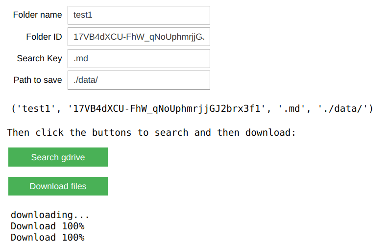

# GoogleDrive_downloader_ipywidgets
Easily search for files in Google drive folders and download them with the press of an ipywidget button



### Two classes:
1. `DriveDownloader`: Thin wrapper around the gdrive documentation's tutorial
2. `WidgetDriveDownloader(DriveDownloader)` Inherited class that adds the ipywidgets for inputting search queries and buttons to search and download

### Notes:
- Can use the `DriveDownloader` class independently in scripts (without ipywidgets)
- Easily customize the two classes to your needs.
- Public Google Drive [folder](https://drive.google.com/drive/folders/1ZHyRvpJbqsZ0Kucf885YNp4_-YuhBYHh?usp=sharing) for testing
- PRs welcome too!

## Installation
```
git clone https://github.com/ljburtz/GoogleDrive_downloader_ipywidgets.git
cd GoogleDrive_downloader_ipywidgets
conda env create -f environment.yml
conda activate gdrive
python -m ipykernel install --user --name=gdrive
jupyter notebook gdrive_downloader.ipynb
```

Get your google drive credentials: `client_id.json` by following [this tutorial](https://medium.com/@umdfirecoml/a-step-by-step-guide-on-how-to-download-your-google-drive-data-to-your-jupyter-notebook-using-the-52f4ce63c66c) by [FIRE Capital One Machine Learning of UMD.edu](https://medium.com/@umdfirecoml)

## Play

- Run all cells
- Authenticate with your personal gdrive credentials: edit the path to where you downloaded `client_id.json`
- Type the inputs into the ipywidget text boxes: choose inside which gdrive folder to look, which type of file you want to download, and where to save the downloaded files on your PC
- Click on the search buttons, then the download button


# Sources / Resources

- Very helpful for setting up the gdrive credentials
https://medium.com/@umdfirecoml/a-step-by-step-guide-on-how-to-download-your-google-drive-data-to-your-jupyter-notebook-using-the-52f4ce63c66c
- Google Drive v3 API docs : https://developers.google.com/drive/api/v3/quickstart/python?authuser=1
